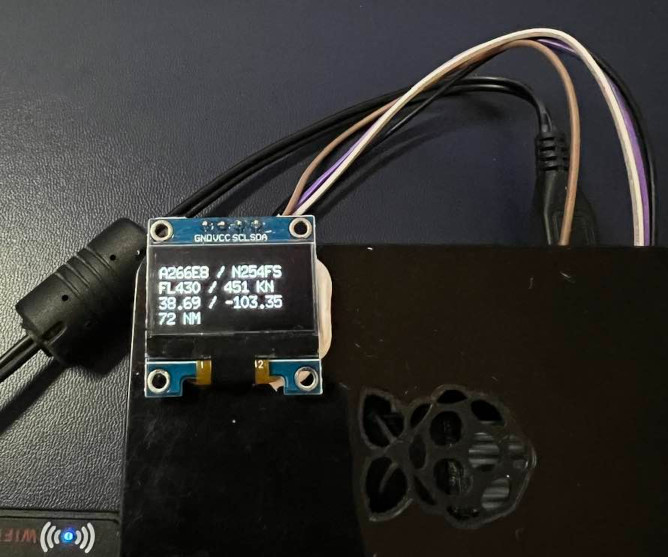

# Finch 
*An LCD status monitor for PiAware*

## Installation

Currently, Finch must be compiled and cannot be installed directly through a package manager. A make file is provided 
for convenience. The binary can be built by running `make` from the root project directory. Finch was developed using 
Go version 1.18.

Finch can be run by running `./finch`. If you want to keep Finch running after closing your terminal, then you can use 
nohup: `nohup ./finch &`

## Configuration

Finch is configured using a configuration yaml file. An example [config.yml](config.yml) file can be found in the root Finch 
directory. The example configuration file contains defaults as well as a description of each field.

## Known Limitations

Currently, Finch only supports the affordable and available SSD1306 LCD display. Additional display types will be
included in future releases.

## Issues

Report issues/recommendations by opening up an issue in the [Finch GitHub](https://github.com/benabernathy/finch/issues) project.